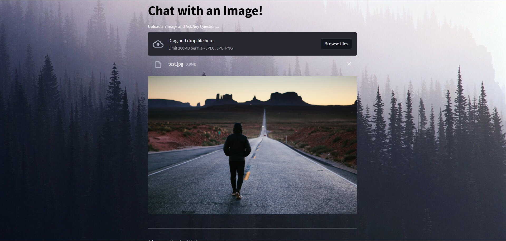
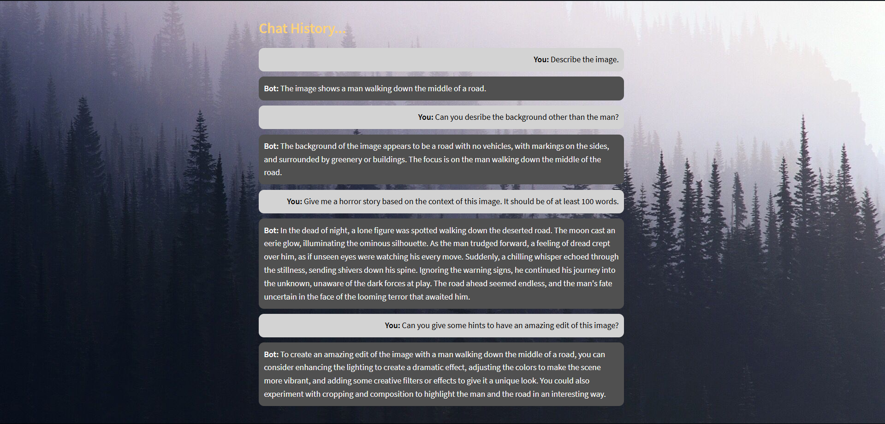

# 🖼️ Chat with an Image

A powerful web application that lets users **upload images** and **ask questions about them**, leveraging state-of-the-art machine learning models for image captioning and object detection, and combining it with the conversational capabilities of **ChatGPT** to provide meaningful and context-aware responses.

## 🚀 Features

- **Image Captioning**: Generates a descriptive caption summarizing the content of an uploaded image using the [BLIP Image Captioning Model](https://huggingface.co/Salesforce/blip-image-captioning-large).
- **Object Detection**: Identifies objects in an image, including bounding boxes, class names, and confidence scores, using [DETR (DEtection TRansformer)](https://github.com/facebookresearch/detr).
- **Dynamic Question Answering**: Combines detected objects and captions to provide intelligent, context-aware responses to user queries using [LangChain](https://langchain-langchain.vercel.app/).
- **Memory-Aware Chat**: Retains the conversation history for a seamless chat experience.
- **Interactive UI**: Built with **Streamlit**, providing an intuitive interface for uploading images and chatting with the AI.


## 🛠️ Technologies Used

- **LangChain**: To combine tools and language models for dynamic responses.
- **OpenAI GPT-3.5**: For generating human-like answers.
- **Python**: Backend programming language.
- **Streamlit**: For creating the interactive web interface.
- **Transformers Library**: For running BLIP and DETR models.
- **Hugging Face Models**:
  - [BLIP](https://huggingface.co/Salesforce/blip-image-captioning-large) for image captioning.
  - [DETR](https://huggingface.co/facebook/detr-resnet-50) for object detection.


## 🧑‍💻 How to Run the Project

### Prerequisites
- Python 3.8 or above
- OpenAI API Key (for GPT-3.5)
- Hugging Face Transformers Library

### Setup Instructions

1. **Clone the repository**:
   ```bash
   git clone https://github.com/your-username/chat-with-image.git
   cd chat-with-image
   ```

2. **Install dependencies**:
   ```bash
   pip install -r requirements.txt
   ```

3. **Add your OpenAI API Key**:
   Go to your OPENAI account and get your API key and paste it in `.env_template`. Rename that file to `.env`
   ```bash
   OPENAI_API_KEY=sk-proj-Isk-XXXX
   ```

4. **Run the app**:
   ```bash
   streamlit run main.py
   ```
   

## 📹 Video Demo

https://github.com/user-attachments/assets/c5531051-4601-4a59-9da8-39a4ede98a43


## ✨ Demo Images

### 1) Upload an image of your choice



### 2) Chat History with the Uploaded Image



## 🤖 Models in Action

- **BLIP (Image Captioning)**:
  - Converts images into descriptive captions to summarize their content.
- **DETR (Object Detection)**:
  - Detects objects with high accuracy and confidence.
- **OpenAI GPT-3.5**:
  - Generates intelligent, conversational responses.


## 🎯 Use Cases

- **Accessibility**: Helping visually impaired users understand images.
- **E-commerce**: Analyzing product images for automated FAQs.
- **Education**: Visual question answering for learning materials.
- **Creative Projects**: Chatbot assistance for graphic design or artwork.


## 🛡️Future Enhancements

- Add support for **real-time image input** via webcam.
- Extend to support multi-modal reasoning (e.g., videos or text+image queries).


## 📜 License

This project is licensed under the MIT License. See the [LICENSE](LICENSE) file for details.


## 🙌 Acknowledgments

- [OpenAI](https://openai.com/) for GPT-3.5.
- [Hugging Face](https://huggingface.co/) for providing pre-trained models.
- [Streamlit](https://streamlit.io/) for simplifying UI development.

